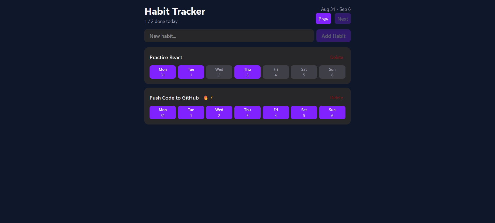

# 🗓️ HabitGridX – Habit Tracker

HabitGridX is a modern and responsive habit tracking website built using React, TypeScript, Tailwind CSS, HTML5, and CSS3. It helps users track their weekly habits, monitor progress, and stay consistent with their daily routines.

---

## 🚀 Live Demo

🌐 [Visit HabitGridX](https://habitgridx.netlify.app/)

---

## 📸 Screenshots

---

## 📌 Features

- 📅 Weekly Habit Tracking – Track and manage habits throughout the week.
- 📊 Progress Tracking – Easily monitor your habit completion and consistency.
- ➕ Add & Manage Habits – Create, update, and manage your personal habits.
- 📱 Responsive Design – Optimized for desktop, tablet, and mobile devices.
- 🎨 Modern UI – Clean and intuitive interface built with Tailwind CSS.
- ⚡ Fast Performance – Built with React and Vite for a smooth development and user experience.

---

## 🛠️ Tech Stack

- React.js – Component-based JavaScript library for building the user interface.
- TypeScript – Provides static typing for safer and more maintainable React code.
- Tailwind CSS – Utility-first CSS framework for creating a modern and responsive design.
- HTML5 – Used for structuring the application.
- CSS3 – Used for styling and custom UI enhancements.
- Vite – Fast frontend build tool and development environment.

---

## 🧑‍💻 Developer

Saikat Maji
 
Full Stack Developer | Tech Explorer | Passionate Builder
 
<a href="https://github.com/saikatmaji">GitHub</a> |
<a href="https://www.linkedin.com/in/saikatmaji/">LinkedIn</a> |
<a href="https://x.com/saikat__maji">X</a>

---

## ⭐ Show Your Support!

- Star this repository
- Fork the repository
- Contribute to the project
- Share on social media

---

## 🧾 License

This project is created for educational and portfolio purposes.  

---